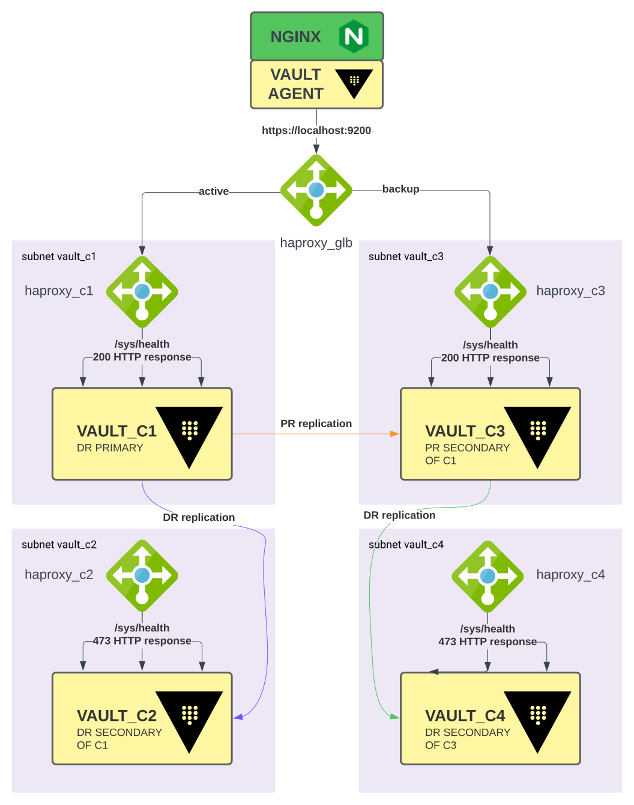

# Vault Enterprise Replication Demo with Docker Compose

**THIS REPO IS NOT FOR PRODUCTION USE**

Stands up four 3-nodes Vault Enterprise clusters to demo replication.



# Quick Start
1. Obtain a Vault Enterprise license, export the content of the license file as an environment variable call `VAULT_LICENSE`
```shell
export VAULT_LICENSE=$(cat ~/Downloads/vault.hclic)
```
2. Install [Docker Compose](https://docs.docker.com/compose/install/#install-compose), it should come with Docker Desktop on Mac.
3. Run `gen_certs.sh` under the `tls` folder to create self-signed certs for the Vault clusters. 
4. Run `make all` to start the docker containers.
5. Run `make tf-apply` to create the KV and PKI mounts using Terraform.
6. Run `make promote-dr-c2` to promote vault_c2 as DR primary. The promotion script pauses the containers for vault_c1 and 
    updates haproxy configuration to point to vault_c2 as the primary cluster, remember to roll back these changes 
    if you want to rebuild the environment from scratch. 
7. Run `make rep-status` to view replication status of all clusters.
8. Run `make demote-primary-c1` to unpause vault_c1 containers and demote the vault_c1 cluster to a DR secondary to vault_c2.
9. Run `make failback-c1` to failback vault_c1 as DR primary and demote vault_c2 as DR secondary.
10. Run `make clean` to tear down the environment.

# Resources

- [Vault Agent with Docker Compose](https://gitlab.com/kawsark/vault-agent-docker/)